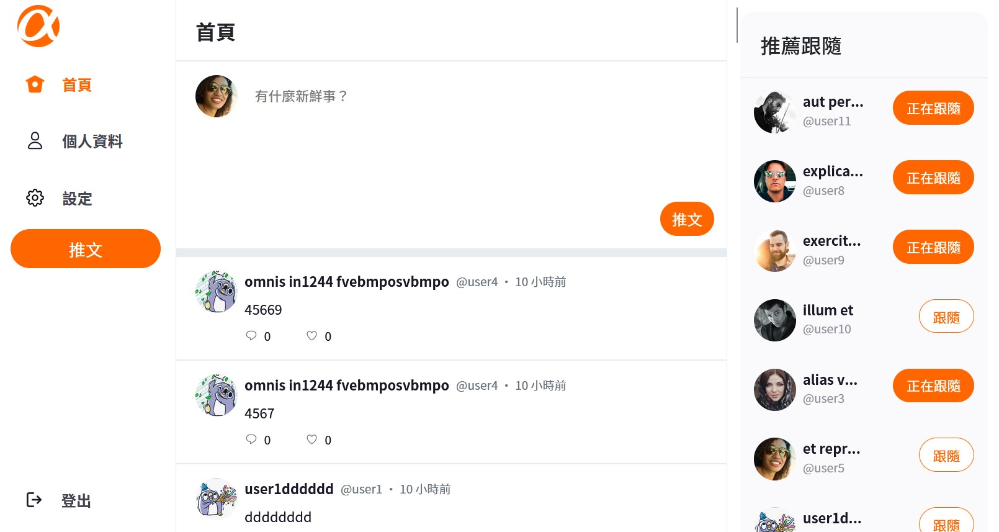

【介紹】

此專案為 Alpha Camp 課程的畢業協作專案，採取前後分離的方式進行小組形式的開發，仿 Twitter 產品的功能與內容。
《後端 repo  網址：https://github.com/ritachien/twitter-api-2022》

【使用方式】

1. 複製本專案
git clone https://github.com/ziwenying/simple-twitter-frontend.git

2. 移動至專案資料夾
cd simple-twitter-frontend

3. 安裝所需要的套件
npm install

4. 在本地啟動專案
npm run serve

5. 打包專案
npm run build

【採用】

vue2 
vuex 
vue-router
axios
scss
sweetalert2
bootstrap

【前台測試帳號】

account: user1
email: user1@example.com
password: 12345678

【後台測試帳號】

account: root
email: root@example.com
password: 12345678

【專案網頁點此進入】

https://ziwenying.github.io/simple-twitter-frontend/#/login

【功能】

-前台-
1. 進行註冊
2. 瀏覽頁面及全部推文
3. 發送推文
4. 回覆推文
5. 按愛心（將推文加入喜愛和取消）
6. 設定使用者的資料
7. 追蹤和取消他人

-後台-
1. 瀏覽所有推文
2. 瀏覽所有使用者及其數據
3. 刪除推文
4. 編輯資料
